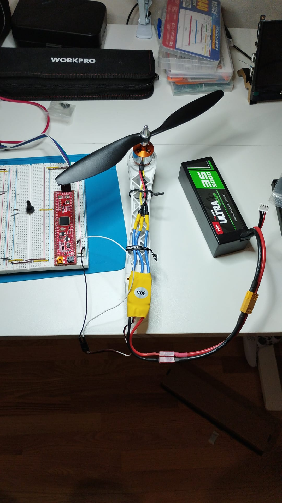

# Controllo Motore Brushless con PIC32MX + ESC + Potenziometro  
*(Brushless Motor Control with PIC32MX + ESC + Potentiometer)*

---

## 🇮🇹 Italiano

### 🎯 Obiettivo
Questo progetto dimostra come controllare un motore **brushless** utilizzando un microcontrollore **PIC32MX795F512L**, un **ESC da 30A**, una **batteria LiPo 3S** e un **potenziometro** collegato all’ingresso analogico **AN4 (RB4)**.  
Girando la manopola del potenziometro, si varia il duty cycle PWM inviato all’ESC, regolando così la velocità del motore.

---

### ⚙️ Configurazione MCC
- **TMR2** → periodo = 20 ms (PR2 = 6249, prescaler = 1:256 → 50 Hz)  
- **OC1** → PWM mode, mappato su **RD0**  
- **ADC1** → canale AN4 (RB4), 10 bit, riferimento AVDD/AVSS (3.3 V)  

---

### 🔌 Collegamenti
- **ESC → PIC32**  
  - Bianco (PWM) → RD0 (OC1)  
  - Nero (GND) → GND del PIC32  
  - Rosso (BEC 5V) → non collegato (PIC alimentato via USB)  
- **Potenziometro**  
  - Estremo 1 → GND  
  - Estremo 2 → +3.3 V  
  - Centrale (wiper) → RB4/AN4  

---

### 🧩 Architettura Software
- **pwm.c / pwm.h** → gestione PWM e conversione µs → tick  
- **adc_control.c / adc_control.h** → gestione ADC, lettura e filtro (EMA)  
- **main.c** → ciclo principale: legge il potenziometro, lo mappa in 1000–2000 µs, aggiorna il PWM per l’ESC  

---

### 📷 Foto
(*inserire qui le foto del setup: breadboard, cablaggi, motore, ESC, potenziometro*)  

---

## 🇬🇧 English

### 🎯 Goal
This project demonstrates how to control a **brushless motor** using a **PIC32MX795F512L** microcontroller, a **30A ESC**, a **3S LiPo battery**, and a **potentiometer** connected to **AN4 (RB4)**.  
By turning the potentiometer knob, the PWM duty cycle sent to the ESC changes, regulating the motor speed.

---

### ⚙️ MCC Configuration
- **TMR2** → period = 20 ms (PR2 = 6249, prescaler = 1:256 → 50 Hz)  
- **OC1** → PWM mode, mapped to **RD0**  
- **ADC1** → channel AN4 (RB4), 10-bit, AVDD/AVSS reference (3.3 V)  

---

### 🔌 Wiring
- **ESC → PIC32**  
  - White (PWM) → RD0 (OC1)  
  - Black (GND) → PIC32 GND  
  - Red (BEC 5V) → not connected (PIC powered via USB)  
- **Potentiometer**  
  - Side 1 → GND  
  - Side 2 → +3.3 V  
  - Middle (wiper) → RB4/AN4  

---

### 🧩 Software Architecture
- **pwm.c / pwm.h** → PWM handling and µs → ticks conversion  
- **adc_control.c / adc_control.h** → ADC handling, read and EMA filter  
- **main.c** → main loop: read potentiometer, map 0–1023 to 1000–2000 µs, update PWM to ESC  

---

### 📷 Photos

  
