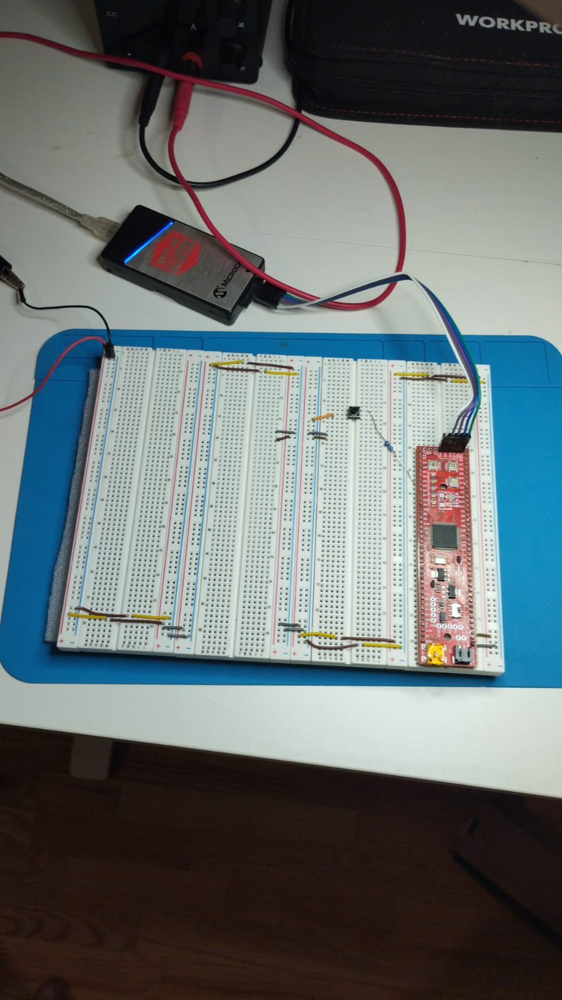

# 🧠 Progetto: LED Toggle con Interrupt Esterno e Debounce Software

**Device:** PIC32MX795F512L  
**IDE:** MPLAB X IDE 6.20  
**Compiler:** XC32 v4.40  
**Configurator:** MCC (MPLAB Code Configurator)  
**Company:** Perez Dynamics  

---

## 📘 Descrizione generale

Questo progetto dimostra come gestire un **interrupt esterno (INT1)** su **RE8** per il controllo di un LED collegato a **RE3**, implementando un **debounce software** per eliminare i rimbalzi meccanici del pulsante.

La logica è completamente **basata su interrupt**, senza alcun polling nel ciclo principale.  
Il LED cambia stato (toggle) ogni volta che il pulsante esterno viene premuto.

---

## ⚙️ Funzionalità principali

- Gestione **interrupt esterno INT1 (RE8)** con trigger sul **fronte di discesa**  
- **Pull-up esterno da 10 kΩ** e pulsante collegato a massa (GND)  
- **Debounce software (20 ms)** realizzato tramite Core Timer  
- LED su **RE3** in configurazione **sinking (anodo a 3.3V)**  
- Architettura modulare: driver `input.c/.h` separato, facilmente riutilizzabile  
- Tutta la logica di gestione del pulsante è incapsulata nel modulo `INPUT`  

---

## 🔩 Schema elettrico semplificato

```
3.3V ---[10kΩ]---+--- RE8 (INT1)
                  |
                [ Pulsante ]
                  |
                 GND

RE3 ---[ LED + 330Ω ]--- 3.3V
```

---

## 📁 Struttura del progetto

```
Interrupt_UserLed.X/
│
├── src/
│   ├── main.c          → inizializzazione e callback LED
│   ├── input.c         → driver per interrupt + debounce software
│   ├── input.h         → header del modulo INPUT
│   └── config/         → file generati da MCC
│
└── README.md           → descrizione del progetto
```

---

## 🧩 Funzionamento

1. Premendo il pulsante esterno collegato a RE8, si genera un fronte di discesa.  
2. L’interrupt INT1 viene gestito dal driver EVIC.  
3. Il modulo `input.c` filtra l’evento con un **debounce di 20 ms**.  
4. Viene eseguita la callback registrata (`OnUserPressed()`), che effettua il **toggle del LED su RE3**.  

Il sistema è completamente asincrono e immediato, adatto per logiche reattive come input utente o comandi macchina.

---

## 🔬 Dettagli tecnici principali

| Funzione | Descrizione |
|-----------|-------------|
| `INPUT_Init(uint32_t debounce_ms)` | Inizializza INT1 con tempo di debounce configurabile |
| `INPUT_RegisterCallback(void (*cb)(void))` | Registra la funzione utente eseguita su pressione |
| `_CP0_GET_COUNT()` | Lettura del Core Timer per misurare intervalli temporali |
| `INTCONSET = _INTCON_INT1EP_MASK` | Configura INT1 su fronte di discesa |
| `LATEINV = (1u << 3)` | Inverte lo stato del LED (toggle) |

---

## 🔧 Componenti hardware utilizzati

- Pulsante **tactile switch 6x6 mm**  
- Resistenza **10 kΩ** (pull-up su RE8)  
- Resistenza **330 Ω** (limitazione corrente LED)  
- LED standard 3 mm (collegato a RE3 in sinking)  
- Alimentazione **3.3 V**  
- Scheda **PIC32MX795F512L**  

---

## 🧠 Obiettivi didattici

- Comprendere la differenza tra **interrupt hardware** e **polling**  
- Gestire correttamente un **input digitale con rimbalzo**  
- Sviluppare codice **modulare e riutilizzabile** per progetti embedded futuri  
- Apprendere la configurazione MCC del modulo **External Interrupt (EVIC)**  

---

## 🚀 Possibili estensioni future

- Aggiunta di gestione **Change Notice (CN)** per pin alternativi  
- Implementazione di **interrupt multipli** su più pulsanti  
- Estensione del driver `INPUT` per supportare **livelli di priorità**  
- Integrazione del modulo con **PWM** per controllo motore brushless  

---

## 📷 Setup reale




---

## 🏁 Stato progetto

✅ **Completato e stabile**  
Versione: 1.0 – Ottobre 2025  
Autore: **Daniele Perez**  

---

## 🇬🇧 English Summary

**Project:** LED Toggle via External Interrupt (INT1) with Software Debounce  
**Device:** PIC32MX795F512L – **IDE:** MPLAB X 6.20 – **Compiler:** XC32 v4.40  

This project demonstrates how to use an **external interrupt (INT1)** on **RE8** to toggle a LED connected to **RE3**.  
A 20 ms **software debounce** implemented with the Core Timer ensures clean input readings.  
The project is fully interrupt-driven, no polling is used.  
Modular design with `input.c/.h` makes it reusable for future applications.
